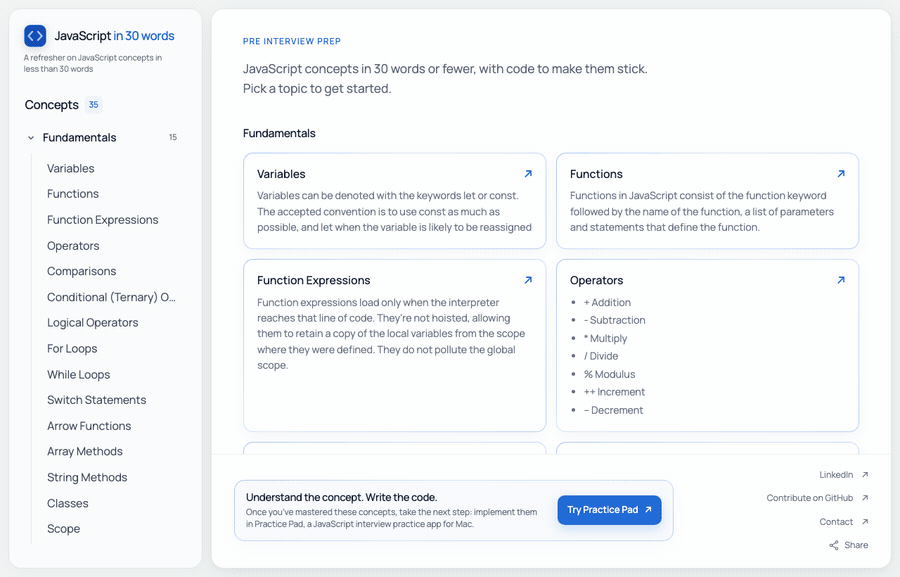

# JavaScript in less than 30 words

[Website](https://www.javascriptin30words.com/)



This project's purpose is to serve as a pre-interview refresher.

It is also my attempt to describe both basic and more advanced JavaScript concepts in less than 30 words.

Distilling complex ideas into simple notions is a key tenet of effective communication and I hope this project encourages me and others to practice this skill.

**Contributions are welcome and encouraged.**

[Contributing guidelines](https://github.com/msmfa/javascript-in-30/blob/master/CONTRIBUTING.md)

A side aim of this project is to allow other junior members of the community to learn how to contribute to open source projects. A goal of the project is to crowdsource the easiest to understand and most accurate definitions of various elements of JavaScript.

## Run locally

Use Node.js 22 or newer. Install the dependencies before starting the local site.

```sh
npm ci
npm run dev
```

Open the local address printed in the terminal. Each concept is a real HTML page, such as `/javascript-closures/`, with its definition and code visible without client-side JavaScript.

## AI panel

Each concept has a collapsible AI panel in place of “What to notice”. Click **AI panel** to expand it, then select **Connect your API key**. Choose OpenAI or Anthropic, enter your API key, and click **Load models**. Select a model returned for your account from the **Model** dropdown, then connect. There is no fixed preset list; loading models makes only read requests and never generates a paid answer. Choose **Other model…** to enter another text model ID available to your account. You can switch models later in **Connection settings**. Connecting checks access to that model without generating an answer. Changing the provider or key clears the loaded list; closing the popup cancels any pending lookup. The AI controls stay disabled until connected. Then enter a question and select **Submit**, or choose **Explain simply**, **Walk through the code**, or **Quiz me**. Each request includes the current definition, code, expected output, and the last five conversation exchanges. Stop cancels a pending request; Clear conversation starts fresh.

Keys stay in page memory by default and are cleared when leaving or reloading the page. **Remember this connection in this tab** optionally stores the key in `sessionStorage` so it survives reloads and navigation between concepts in that tab. Disconnect clears the connection and conversation. Requests go directly from the visitor's browser to their selected provider; the site has no AI proxy, stores no keys on its server, and makes no automatic explanation requests. API billing is separate from ChatGPT or Claude subscriptions. Keys need access to the selected model and its model lookup endpoint; some restricted accounts may disallow browser connections.

Model discovery uses the [OpenAI Models API](https://developers.openai.com/api/reference/resources/models/methods/list) or the [Anthropic Models API](https://platform.claude.com/docs/en/api/models/list), including pagination. Known image, audio, embedding, moderation, and specialist model families are omitted from the OpenAI list. That endpoint does not expose endpoint compatibility, so a listed model may still reject a Responses request; custom IDs and clear provider errors remain available. Model lists are kept in page memory, never stored with the key.

The AI panel uses the [OpenAI Responses API](https://developers.openai.com/api/docs/guides/text) with `store: false` or the [Anthropic Messages API](https://platform.claude.com/docs/en/api/messages/create). Replies are rendered as text and a limited set of Markdown elements; returned HTML and code are never executed. The static definitions and examples remain available when JavaScript is disabled. The development server and generated hosting headers allow the two AI providers and the configured analytics origins, while blocking inline scripts, injected scripts from other hosts, and form submission.

## Content and checks

Edit `src/data.js` to change an example, updating `output` to match its console output. Descriptions and `definitionItems` preserve the original site's wording; intentional copy changes must also update the source snapshot in `test/fixtures/original-descriptions.json`. Preserve existing slugs so shared links keep working.

```sh
npm test
npm run build
```

Tests run all 35 examples, compare every description and bullet list with the original site snapshot in `test/fixtures/original-descriptions.json`, check the rendered HTML and internal links, and validate the sitemap. The original wording is preserved even where it exceeds 30 words. The generated site is written to `build/`. The archived image assets in `src/assets/` use lossless WebP; they are not shipped with the site. Code examples are selectable text, with JavaScript syntax highlighting generated at build time using highlight.js.

AI tests use simulated provider responses to check request formats, conversation context, connection validation, storage opt-in, cancellation, and error handling without using a real key or incurring API charges. A live explanation requires a valid visitor-supplied API key and API credits.

The header and favicon share the optimised 64px `src/logo.webp`, served with a content hash and immutable cache headers. `src/logo.svg` is its editable vector source and is not deployed. When changing the logo, export the vector at 64 × 64 pixels with transparency and encode it using lossless WebP before rebuilding.

The interface uses a locally served Latin variable subset of [Manrope](https://fonts.google.com/specimen/Manrope), with regular and medium weights. The 24 KB WOFF2 file is preloaded, content-hashed, and cached; no external font request is made by visitors. Code examples keep their monospace font. The font’s SIL Open Font License is in `src/fonts/OFL.txt` and is copied into the generated assets.

